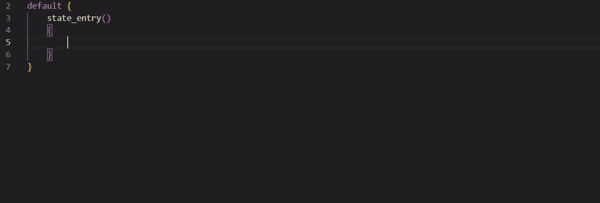
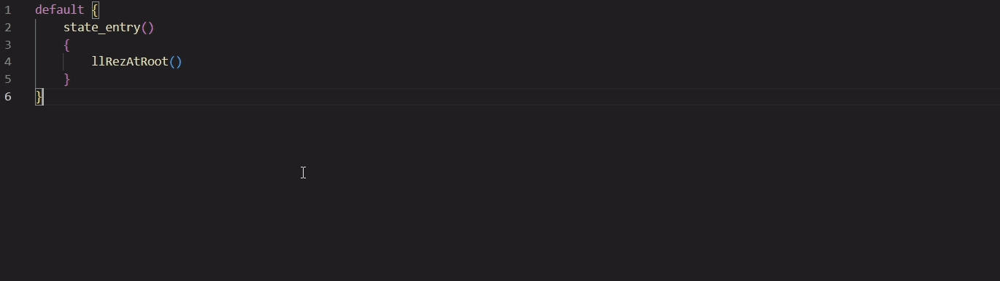
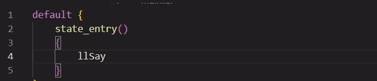

# LSL for Visual Studio Code

The LSL extension adds language support for LSL secondlife scripting language to Visual Studio Code

## Functionality
- Support LSL version 2023-01-27.577942
- Syntax hilighting 

## Completion sugestions

## Hover description

## Signature help
